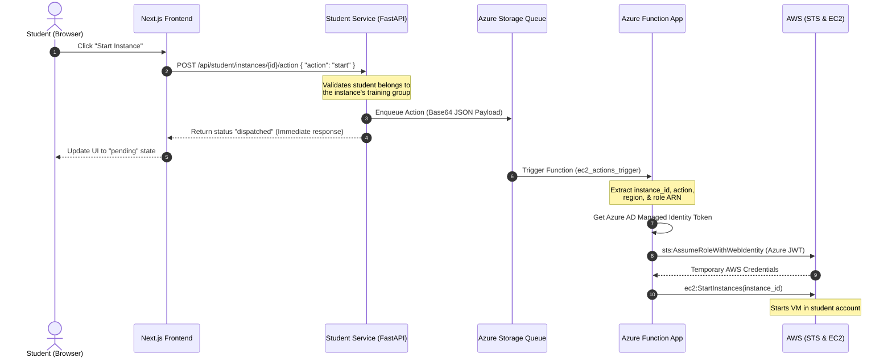

# Cloud Training Management Portal (CTMP) - Architecture & Logic

Welcome to the **Contoso Cloud Training Management Portal (CTMP)** codebase. This document outlines how the Next.js frontend, FastAPI microservices, and Azure Functions interact to deliver a secure, multi-tenant sandbox management platform.

---

## 1. High-Level Architecture

CTMP is designed with a **zero-trust, cross-cloud architecture** spanning Microsoft Azure and Amazon Web Services (AWS). It utilizes federated identities (OIDC) to control AWS sandbox resources without storing persistent AWS credentials in Azure.

```mermaid
graph TD
    %% Users
    U[User Browser] -->|HTTPS| AGW[Azure App Gateway / WAF v2]

    %% Ingress and Gateway
    subgraph Azure Cloud - Central India Region
        subgraph Virtual Network (VNet)
            AGW -->|Ingress| AKS[Private AKS Cluster]
            
            subgraph AKS Pods
                FE[Next.js Frontend]
                AUTH[Auth Service]
                ADM[Admin Service]
                TRN[Trainer Service]
                STD[Student Service]
                BIL[Billing Service]
                ANL[Analytics Service]
            end
            
            %% Azure storage & messaging
            STD -->|Enqueue action| ASQ[Azure Storage Queue: ec2-actions]
            
            %% Function App
            subgraph Azure Function Plan
                FUNC[Azure Function App]
            end
            
            ASQ -.->|Queue Trigger| FUNC
            FUNC -->|1. Request Token| ENTRA[Microsoft Entra ID]
            ENTRA -.->|2. Azure JWT Token| FUNC
        end
    end

    %% AWS Cloud
    subgraph AWS Cloud - Global Sandbox Accounts
        FUNC -->|3. sts:AssumeRoleWithWebIdentity| STS[AWS STS]
        STS -.->|4. Temporary AWS Credentials| FUNC
        FUNC -->|5. EC2 Lifecycle Action| EC2[Student AWS EC2 Instance]
    end

    %% GitOps & Container Registry
    subgraph GitOps & CI/CD
        ACR[Azure Container Registry] -.->|ArgoCD Image Updater| ARG[ArgoCD Controller]
        ARG -->|Reconcile Manifests| AKS
    end
```

---

## 2. Component Directory Structure

The application code is organized inside the `src/` directory:

*   **`frontend/`**: A Next.js 15 web application styled with TailwindCSS and powered by Radix UI (shadcn/ui). Uses Microsoft MSAL React for Entra ID authentication.
*   **`services/`**: FastAPI microservices running in Docker containers, deployed via GitOps on AKS:
    *   `auth-service`: Checks user profile details and validates tokens.
    *   `admin-service`: Manages users, assigns roles, and maintains administrative audit logs.
    *   `trainer-service`: Generates AWS trust-policy CloudFormation templates and manages training groups.
    *   `student-service`: Fetches student sandboxes and dispatches VM actions to the queue.
    *   `billing-service`: Aggregates platform cost summaries and budgets.
    *   `analytics-service`: Exposes dashboard statistics and streams live actions using Server-Sent Events (SSE).
*   **`functions/`**: Azure Function App written in Python. It processes VM actions from the queue, exchanges tokens with AWS STS, and manages EC2 lifecycles.

---

## 3. Core Logic & Operational Flows

### A. Authentication & Role-Based Access Control (RBAC)

1.  **Single Sign-On (SSO)**: The Next.js frontend uses `@azure/msal-react` to authenticate users against Microsoft Entra ID.
2.  **App Roles**: Users are assigned roles (`Admin`, `Trainer`, `Student`) inside Entra ID. These roles are baked into the JWT ID token (`roles` claim).
3.  **Token Validation**: 
    *   FastAPI microservices validate the incoming Bearer JWT tokens in request headers (`Authorization: Bearer <token>`).
    *   Validation is performed using JSON Web Key Sets (JWKS) fetched from the Entra ID tenant endpoint (`RS256` encryption).
    *   The `dependencies.py` module in each microservice decodes claims, verifies signatures, and asserts required roles (e.g., `@app.get` endpoints protected by `require_admin` or `require_trainer`).

---

### B. Cross-Cloud Identity Federation (OIDC Trust)

To avoid storing AWS Access Keys in Azure databases, CTMP uses **OIDC Federated Trust**:

1.  The Trainer generates a CloudFormation template in the **Trainer portal**. This template creates an **IAM OIDC Identity Provider** in the target AWS Account pointing to the Azure Active Directory Tenant:
    `https://sts.windows.net/${AzureTenantID}/`
2.  The template creates an IAM Role (e.g., `AzureMIFederatedRole`) with a trust policy that allows `sts:AssumeRoleWithWebIdentity` only if the audience matches the Azure Managed Identity's Client ID.
3.  When the Azure Function executes, it uses its **User-Assigned Managed Identity** to request a JWT token from Azure AD (audience: `api://<AzureClientID>`).
4.  It presents this JWT token to AWS STS, which verifies the token signature against Microsoft's public keys and returns temporary AWS credentials.
5.  The Azure Function uses these credentials to authorize the `boto3` EC2 client and perform lifecycle commands.

---

### C. EC2 Lifecycle Action Flow

When a student starts or stops an EC2 sandbox, the action flows asynchronously through the system:



---

## 4. Microservices Details

| Service | Prefix | Core Responsibility | Key Endpoints |
| :--- | :--- | :--- | :--- |
| **`auth-service`** | `/api/auth` | Parses and validates user claims. | `/me`, `/roles`, `/validate` |
| **`admin-service`** | `/api/admin` | Performs user role audits and creates training groups. | `/users`, `/users/{id}/role`, `/groups`, `/audit-log` |
| **`trainer-service`** | `/api/trainer` | Generates trust templates and enrolls students in groups. | `/aws-template`, `/groups`, `/groups/{id}/students`, `/groups/{id}/instances` |
| **`student-service`** | `/api/student` | Shows sandbox VMs and schedules VM lifecycle changes. | `/groups`, `/instances`, `/instances/{id}/action`, `/instances/{id}/status` |
| **`billing-service`** | `/api/billing` | Aggregates sandbox spends, budgets, and utilization. | `/summary`, `/costs`, `/costs/group/{id}`, `/costs/student/{id}` |
| **`analytics-service`** | `/api/analytics` | Provides metrics charts data and live SSE activities stream. | `/dashboard`, `/activity` (SSE), `/metrics/instances` |

---

## 5. Security & Isolation Controls

*   **Network Isolation**: All microservices run in a private subnet on AKS. Only the **Azure Application Gateway WAF v2** is exposed to the public Internet, filtering malicious HTTP traffic.
*   **Tenant Separation**: Sandbox environments run in distinct AWS accounts. The Azure Function assumes different AWS IAM Roles depending on the training group context (`group_id`), keeping student workloads isolated.
*   **Auditing**: The `admin-service` logs every sensitive transaction (such as role modifications, group creations, and VM lifecycle actions) in an audit ledger.

---

## 6. Development & Next Steps

Currently, the services use in-memory stores (`_groups_store`, `_instances_store`, etc.) with mock seed data for development and local testing. 

To complete the application development, the following backends are planned:
1.  **State Persistence**: Replace in-memory stores with **Azure Cosmos DB** (NoSQL API) for storing user profiles, group mappings, audit logs, and instances metadata.
2.  **AWS Resource Sync**: Implement a background synchronizer (or event-driven bridge via AWS EventBridge/Azure Event Grid) to regularly query AWS EC2 statuses and keep the database in sync.
3.  **Real-time SSE Bindings**: Bind the `analytics-service` SSE activity stream to live Cosmos DB Change Feed listeners and Azure Queue logs.
